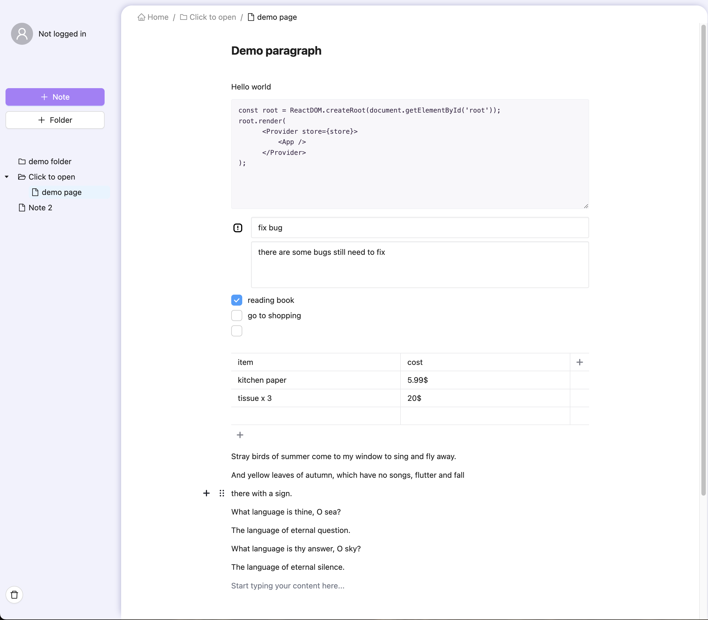

# Air Notebook

Air Notebook is a feature-rich notebook application inspired by Notion, built with **React** and **ASP.NET Core**. It leverages **Editor.js** for a powerful rich-text editing experience and uses **PostgreSQL** as the database backend for user authentication and cloud data storage.

## Features
- **Rich Text Editor**: Powered by [Editor.js](https://editorjs.io/), enabling a flexible and intuitive content creation experience.
- **User Management**: Supports user registration, login, and secure data storage.
- **Cloud Sync**: Saves notes and files to the cloud using PostgreSQL.



## Prerequisites
Before starting, ensure you have the following tools installed:

- [Docker](https://www.docker.com/) (including Docker Compose)
- [.NET SDK](https://dotnet.microsoft.com/download) (for backend development and database migrations)
- [Node.js](https://nodejs.org/) (for local frontend development, optional but recommended)

## Getting Started
Follow these steps to run the application locally:

### Step 1: Clone the Repository
```bash
git clone https://github.com/Mikalasa/air-notebook.git
cd air-notebook
```

### Step 2: Verify Docker Installation
Ensure Docker is installed and running by checking its version:
```bash
docker --version
docker-compose --version
```

### Step 3: Start the Database Container
Start the PostgreSQL database container:
```bash
docker-compose up db -d
```

### Step 4: Apply Database Migrations
Navigate to the backend `server` folder:
```bash
cd server
```

Run the following commands to create and apply database migrations:
```bash
dotnet ef migrations add InitialCreate
dotnet ef database update
```

### Step 5: Build and Start the Application
Return to the project root directory and run:
```bash
docker-compose up --build
```

### Step 6: Verify Services
Once the application is running, verify the following services:

- **Frontend**: [http://localhost:3000](http://localhost:3000)
- **Backend API**: [http://localhost:5001](http://localhost:5001)
- **Database**: Connect to PostgreSQL at `localhost:5432` with the following credentials:
    - **Username**: `postgres`
    - **Password**: `postgres`
    - **Database**: `AirNotebookDB`

## License
This project is licensed under the [MIT License](https://opensource.org/licenses/MIT).


## Issues
If you encounter any issues, feel free to open an issue in the [GitHub repository](https://github.com/Mikalasa/air-notebook/issues).
